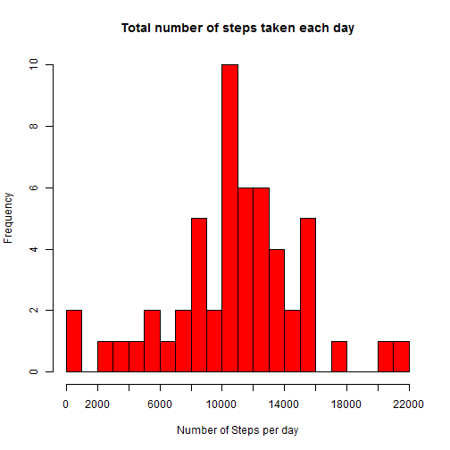
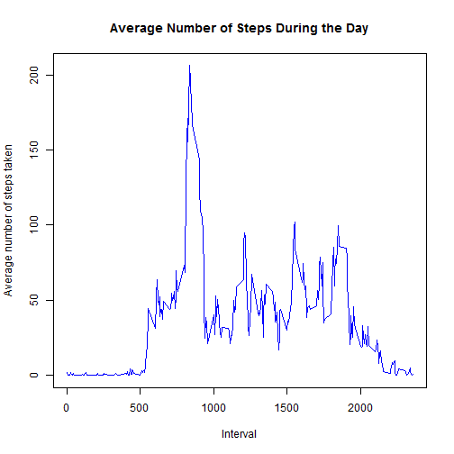
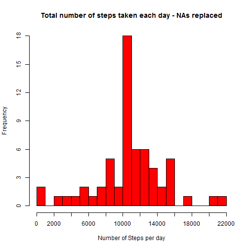
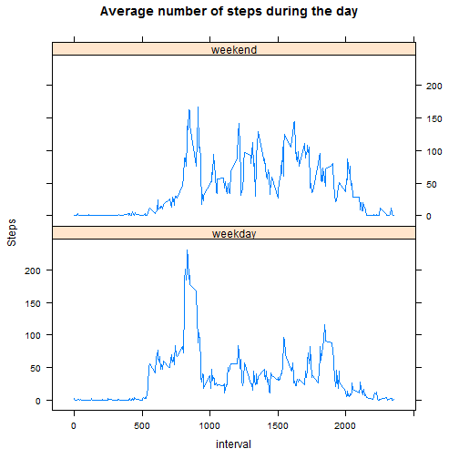

# Coursera Reproducible Research - Peer Assessment 1

This report was developed for the Peer Assessment 1, from Coursera Reproducible 
Research Course. It is now possible to collect a large amount of data about 
personal movement using activity monitoring devices such as a Fitbit, Nike 
Fuelband, or Jawbone Up. These type of devices are part of the "quantified 
self" movement - a group of enthusiasts who take measurements about themselves 
regularly to improve their health, to find patterns in their behavior, or 
because they are tech geeks. But these data remain under-utilized both because 
the raw data are hard to obtain and there is a lack of statistical methods and 
software for processing and interpreting the data.

This assignment makes use of data from a personal activity monitoring device. 
This device collects data at 5 minute intervals through out the day. The data
consists of two months of data from an anonymous individual collected during the 
months of October and November, 2012 and include the number of steps taken in 
5 minute intervals each day.

The data for this assignment can be downloaded from the GitHub repository. The 
variables included in this dataset are:
- steps: Number of steps taking in a 5-minute interval (missing values are coded as NA)
- date: The date on which thsue measurement was taken in YYYY-MM-DD format
- interval: Identifier for the 5-minute interval in which measurement was taken


## Loading Packages
The first thing to do is to load the packages that will be used in the analysis.


```r
library(plyr, w=FALSE)
library(dplyr, w=FALSE)
```


## Loading and preprocessing the data

The data was loaded into [R] with the function read.csv. Then, using "dplyr"
function "filter", were excluded rows with missing values.  It is assumed that 
the file "activity.csv" is in the current working directory. Data can be 
downloaded from [here](https://github.com/raencinas/RepData_PeerAssessment1/blob/master/activity.zip). 


```r
data <- read.csv("activity.csv", header = TRUE, colClasses = c("date" = "Date"))
data_no_na <- filter(data, !is.na(steps))
summary(data)  
```

```
##      steps             date               interval     
##  Min.   :  0.00   Min.   :2012-10-01   Min.   :   0.0  
##  1st Qu.:  0.00   1st Qu.:2012-10-16   1st Qu.: 588.8  
##  Median :  0.00   Median :2012-10-31   Median :1177.5  
##  Mean   : 37.38   Mean   :2012-10-31   Mean   :1177.5  
##  3rd Qu.: 12.00   3rd Qu.:2012-11-15   3rd Qu.:1766.2  
##  Max.   :806.00   Max.   :2012-11-30   Max.   :2355.0  
##  NA's   :2304
```


## What is mean total number of steps taken per day?

### 1. Calculate the total number of steps taken per day

First, we need to calculate the number of steps for each day:


```r
steps_day <- ddply(data_no_na, .(date), summarize, steps=sum(steps))
head(steps_day)  
```

```
##         date steps
## 1 2012-10-02   126
## 2 2012-10-03 11352
## 3 2012-10-04 12116
## 4 2012-10-05 13294
## 5 2012-10-06 15420
## 6 2012-10-07 11015
```

### 2. Make a histogram of the total number of steps taken each day

Second, we can make a histogram with the total number of steps for each day


```r
with(steps_day, hist(steps, main = "Total number of steps taken each day", 
                     xlab = "Number of Steps per day", col="red", breaks = 22,
                     xaxt='n'))
axis(1, at=seq(0,22000,by=2000))
```

 

### 3. Calculate and report the mean and median of the total number of steps taken per day

The third step is to calculate the mean and the median of steps taken per day.


```r
mean(steps_day$"steps")
```

```
## [1] 10766.19
```

```r
median(steps_day$"steps")
```

```
## [1] 10765
```


## What is the average daily activity pattern?

### 1. Make a time series plot (i.e. type = "l") of the 5-minute interval (x-axis) and the average number of steps taken, averaged across all days (y-axis)

First we need to take the average steps by interval:


```r
steps_interval <- ddply(data_no_na, .(interval), summarize, steps=mean(steps))
head(steps_interval)
```

```
##   interval     steps
## 1        0 1.7169811
## 2        5 0.3396226
## 3       10 0.1320755
## 4       15 0.1509434
## 5       20 0.0754717
## 6       25 2.0943396
```

The next plot shows the average number os steps taken at each 5-minute interval, showing how the person activity evolves during the day.


```r
with(steps_interval, plot(interval, steps, xlab = "Interval", 
                ylab = "Average number of steps taken", type = "l", 
                col="blue", main="Average Number of Steps During the Day"))
```

 

### 2. Which 5-minute interval, on average across all the days in the dataset, contains the maximum number of steps?

The interval with the maximum number of steps is given by the "which.max" function.


```r
steps_interval[which.max(steps_interval$steps),]
```

```
##     interval    steps
## 104      835 206.1698
```

## Imputing missing values

Note that there are a number of days/intervals where there are missing values (coded as NA). The presence of missing days may introduce bias into some calculations or summaries of the data.

### 1. Calculate and report the total number of missing values in the dataset 

The number of missing values can be calculated with the function "is.na()". The result is a logical vector. Then, we can sum the TRUES = 1 and FALSES = 0.


```r
data_na <- is.na(data$steps)
sum(data_na)
```

```
## [1] 2304
```

### 2. Devise a strategy for filling in all of the missing values in the dataset. The strategy does not need to be sophisticated. For example, you could use the mean/median for that day, or the mean for that 5-minute interval, etc.
To replace NAs in a Dataset, we can use function "ddply()" from package "plyr". 
The NAs were replaced by the mean of the 5-minute interval.


```r
replace.mean <- function(x) replace(x, is.na(x), mean(x, na.rm = TRUE))
data_replace <- ddply(data, ~ interval, transform, steps = replace.mean(steps))
data_replace <- arrange(data_replace, date, interval)
```


### 3. Create a new dataset that is equal to the original dataset but with the missing data filled in.
Here we can compare the original dataset with the replaced one, and with the 
average steps for each interval. 


```r
head(data)
```

```
##   steps       date interval
## 1    NA 2012-10-01        0
## 2    NA 2012-10-01        5
## 3    NA 2012-10-01       10
## 4    NA 2012-10-01       15
## 5    NA 2012-10-01       20
## 6    NA 2012-10-01       25
```

```r
head(data_replace)
```

```
##       steps       date interval
## 1 1.7169811 2012-10-01        0
## 2 0.3396226 2012-10-01        5
## 3 0.1320755 2012-10-01       10
## 4 0.1509434 2012-10-01       15
## 5 0.0754717 2012-10-01       20
## 6 2.0943396 2012-10-01       25
```

```r
head(steps_interval)
```

```
##   interval     steps
## 1        0 1.7169811
## 2        5 0.3396226
## 3       10 0.1320755
## 4       15 0.1509434
## 5       20 0.0754717
## 6       25 2.0943396
```

Finally, we can see if there is any missing value:


```r
data_replace_na <- is.na(data_replace$steps)
sum(data_replace_na)
```

```
## [1] 0
```

### 4. Make a histogram of the total number of steps taken each day and Calculate and report the mean and median total number of steps taken per day. Do these values differ from the estimates from the first part of the assignment? What is the impact of imputing missing data on the estimates of the total daily number of steps?

First, we need to calculate the number of steps for each day in the new dataset:


```r
steps_day_rep <- ddply(data_replace, .(date), summarize, steps=sum(steps))
head(steps_day_rep)  
```

```
##         date    steps
## 1 2012-10-01 10766.19
## 2 2012-10-02   126.00
## 3 2012-10-03 11352.00
## 4 2012-10-04 12116.00
## 5 2012-10-05 13294.00
## 6 2012-10-06 15420.00
```


Then, we need to create a new histogram, using the new dataset.


```r
with(steps_day_rep, hist(steps, main = "Total number of steps taken each day - NAs replaced", 
                     xlab = "Number of Steps per day", col="red", breaks = 22,
                     xaxt='n', yaxt='n'))
axis(1, at=seq(0,22000,by=2000))
axis(2, at=seq(0,18, by=3))
```

 

The third step is to calculate the mean and the median of steps taken per day.


```r
mean(steps_day_rep$"steps")
```

```
## [1] 10766.19
```

```r
median(steps_day_rep$"steps")
```

```
## [1] 10766.19
```

The values are almost the same as the estimates from the first part of the assignment. The difference is that we have more days inside the 10.000-11.000 steps range. In the first histogram, there are 10 days inside this range; in the second histogram, there are 18 days. 

## Are there differences in activity patterns between weekdays and weekends?
For this part the weekdays() function may be of some help here. Use the dataset with the filled-in missing values for this part.

### 1. Create a new factor variable in the dataset with two levels - "weekday" and "weekend" indicating whether a given date is a weekday or weekend day.

First, we need to create a column with the day of the week:


```r
data2 <- mutate(data_replace, DayWeek = weekdays(date))
```

Now, we need to replace the days of the week with "weekday" or "weekend". First, replace "Sábado" (Saturday) and "Domingo" (Sunday) for "Weekend". Then, replace the other days with "weekday".


```r
replace_weekend <- function(x) replace(x, x=="sábado" | x=="domingo", "weekend")
data_weekend <- ddply(data2, ~ date, transform, DayWeek = replace_weekend(DayWeek))
replace_weekday <- function(x) replace(x, x!="weekend", "weekday")
data_weekdays <- ddply(data_weekend, ~ date, transform, DayWeek = replace_weekday(DayWeek))
```

To verify if there's only "weekday" and "weekend", we can use function "unique()".


```r
unique(data_weekdays$DayWeek)
```

```
## [1] "weekday" "weekend"
```

To verify the number of "weekends" and "weekdays", we can use function "count()":


```r
count(data_weekdays, DayWeek)
```

```
## Source: local data frame [2 x 2]
## 
##   DayWeek     n
## 1 weekday 12960
## 2 weekend  4608
```

### 2. Make a panel plot containing a time series plot (i.e. type = "l") of the 5-minute interval (x-axis) and the average number of steps taken, averaged across all weekday days or weekend days (y-axis). 

First we need to take the average steps by interval for "weekend" and "weekday":


```r
weekend_interval <- data_weekdays %>% filter(DayWeek == "weekend") %>% 
        ddply(.(interval), summarize, steps=mean(steps)) 
head(weekend_interval)
```

```
##   interval       steps
## 1        0 0.214622642
## 2        5 0.042452830
## 3       10 0.016509434
## 4       15 0.018867925
## 5       20 0.009433962
## 6       25 3.511792453
```

```r
weekday_interval <- data_weekdays %>% filter(DayWeek == "weekday") %>% 
        ddply(.(interval), summarize, steps=mean(steps)) 
head(weekday_interval)
```

```
##   interval      steps
## 1        0 2.25115304
## 2        5 0.44528302
## 3       10 0.17316562
## 4       15 0.19790356
## 5       20 0.09895178
## 6       25 1.59035639
```

Then, we can create the painel plot:


```r
par(mfrow=c(2,1))
par(oma=c(2,2,2,2))
par(mar=c(0,4,2,2))
with(weekend_interval, plot(interval, steps, xaxt = "n", type="l", xlab=NA, 
                            ylab=NA, ylim=c(0,250),cex.axis=0.75, col="blue"))
mtext("weekend", side=3, line=-1, col="red")
par(mar=c(2,4,0,2))
with(weekday_interval, plot(interval, steps, xlab=NA, ylab=NA, type="l", 
                            ylim=c(0,250), cex.axis=0.75, col="blue"))
mtext("weekday", side=3, line=-1, col="red")
mtext("Average Number of Steps During the Day", side=3, outer=T, cex=1.25, font=2)
mtext("Interval", side=1, outer=T)
mtext("Number of Steps", side=2, outer=T)
```

 


The plot shows that weekdays have a higher peak, with the activity concentrated 
between the 800 and 1000 intervals. On weekends, the activity is more disperse, 
with more peaks higher than 100 steps.

================================================================================
